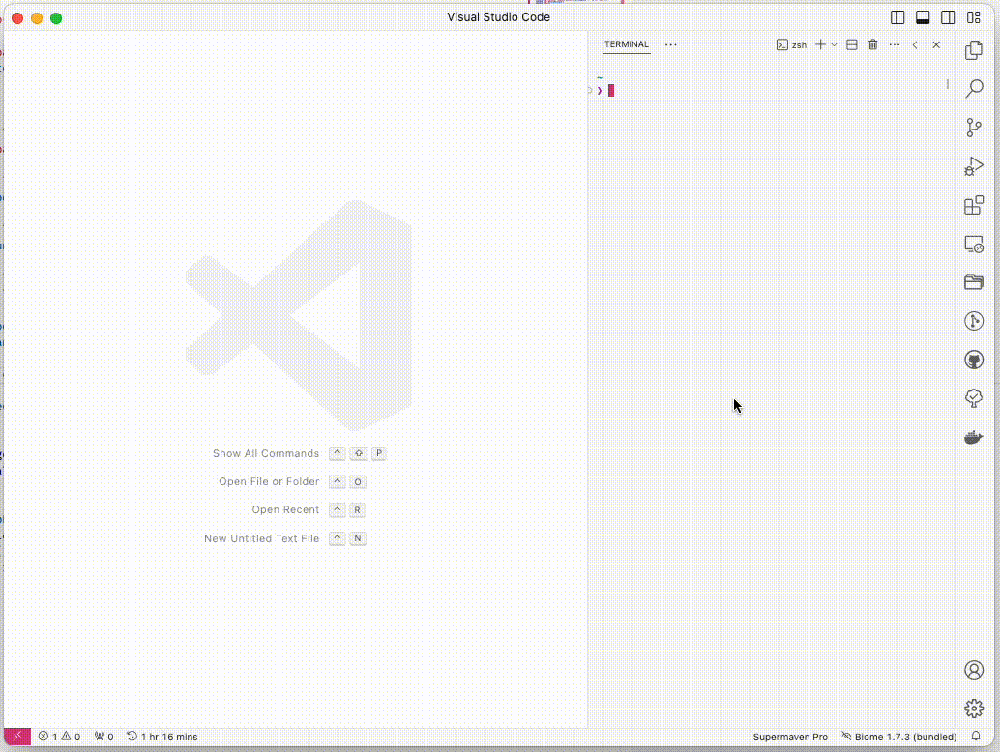

# Localpen

Quickly run and evaluate code with the speed of [Bun][bun].



### Synopsis

I like to just run some one-off code snippets sometimes.
There are browser-based solutions like [CodePen](https://codepen.io) or [Stackblitz](https://stackblitz.com), but they come with their own editor and are inherently slow.

Localpen is a CLI tool that allows you to run and evaluate code with the speed of [Bun][bun]. It creates a project folder in a temporary directory, opens it in VSCode and immediately runs the code in Bun using the bun watch command.

Opening in VSCode uses the `--wait` flag, so that closing the editor will tell Localpen to stop the evaluation and show a prompt to delete the temporary directory.

### Usage

- Install [bun][bun]:

  ```bash
  # Linux & macOS
  curl -fsSL https://bun.sh/install | bash
  ```

  ```ps
  # Windows
  powershell -c "irm bun.sh/install.ps1 | iex"
  ```

- Run `localpen`:
  ```bash
  bunx localpen
  ```

### Templates

To start, there are two templates available:

- `typescript`/`ts`
- `javascript`/`js`

To use a template, run `localpen` with the `-t` flag:

```bash
bunx localpen -t ts
```

All [vite](https://vitejs.dev) templates are planned to be added soon.

[bun]: https://bun.sh
